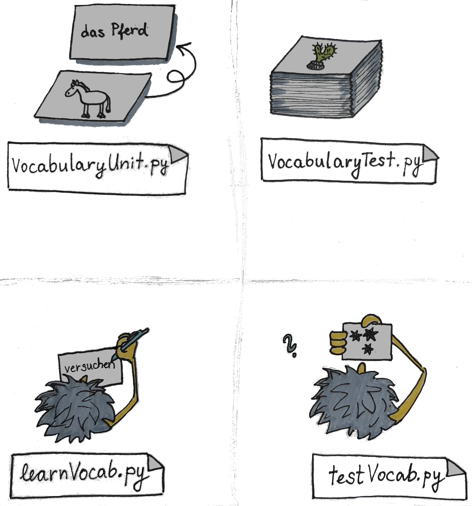

# TimeSpacedVocabularyGame
Game for testing vocabulary in your target language.

It is a flashcard-style of testing, with an extra feature of flashcards appearing with decreasing frequency (see [Forgetting curve]
(https://en.wikipedia.org/wiki/Forgetting_curve)).

There are two different versions of this game, one is meant for learning and the other for testing vocabulary.

## Learning vocabulary
It is designed for adding new vocabulary to your flashcard deck.

## Testing vocabulary
It tests vocabulary from your deck based on your previous performance and the time passed since the last testing. 
Correct answers prompt the flashcard to reappear on the day of learning, the next week, after a month, and one final time after three months, at which point the expression is considered learned.

## How does it work (detailed)
Here I will add more detailed description on how to use this game. A simple schema shows purpose of some of the files included in this project.  

### Creating a flash card deck:
1. One need to run 'learnVocabulary.py', pick file name, and press 'loadVocabTest' to loading existing deck or create new one.
2. Next steps are writing prompts in native and target language. Native language fields will be used as prompts for your answers in target language. Both native and target group consist of two fields. Top one can be single word, or an expression. This will need to be a perfectly match with an answer in order to be correct. Native and target 'example sentence' are not mandatory fields. 
3. Step 2. is repeated for however many expressions. After adding new vocabulary press 'Save Game' button to save. 
4. To Exit this window one can press 'Exit Game'.  

### For testing from flash cards:
5. Run 'testVocab.py' file. Enter the filename of deck you want to be tested on and press 'Load VocabTest' button.Information about the number of flashcards will be displayed in the terminal.
6. To start test press 'Next' to show the first prompt. If  given expression contains both short and example sentence version, they will be displayed. 
7. Next step is to wite the answer. The example sentence is preffered, but also short expression is compared with the answer.
8. After answer field is filled  'Submitt answer' should be pressed. Correct answers for both short and long targets are displayed under the answer field. 
9. For testing the next expression press 'Next'.
10. After testing is complete (either the deck is empty or one wants to close test), press 'Save Game' to save the progress and update tested vocabulary in the deck. 
11. To close the game window and extit game press 'Exit Game'.   

### Logic for points and when the expression is considered learned 
The idea here is to use point system to track learning of every expression. Newly added expression starts with value 0 and with each correct translation it will increase its value in one-point increments, while an incorrect translation resets value to zero. Time spaced part controlls when the given expression will appear in testing.  

#### Time-spaced feature
Point system shows how many times an expression has been traslated correctly.  Expressions with a value of 0 can be tested at any time (newly added or previously incorrectly translated expression). At least one day since last testing is required for expressions with value=1 to appear in another test.  Expressions with values 2 and 3 reappear after one month and three months, respectively. An expression is considered learned when it reaches a value of 4 and will not appear in subsequent tests.

#### When a translation is correct?
This can of course depend on the target language and since this project has been written focusing on German translations it leads to several special features.  
There is a slight difference in expressions containing an example sentence and those not. For expressions without an example sentence, an exact match with the target is required. One of the features is a special treatment for nouns. If a noun is tested, in order to be awarded a point a noun needs to match and a correct article is required. In the case of incorrect article, points will stay the same. Expressions with example sentences can be translated either as a short expression or the entire example sentence. Partially correct translations of an example sentence maintain the current point value.